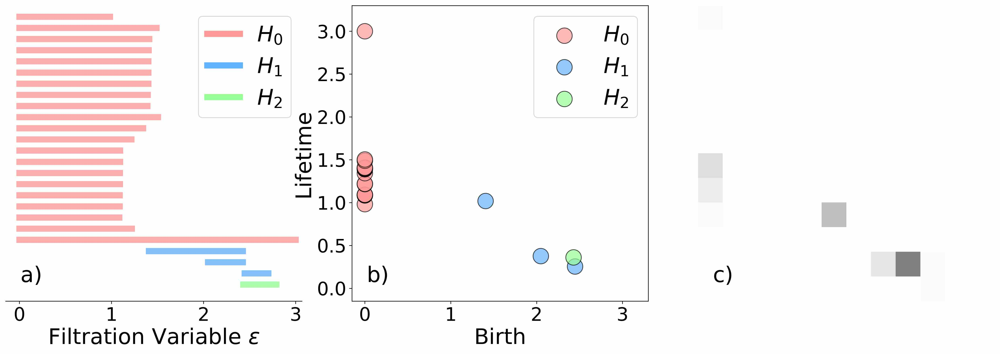
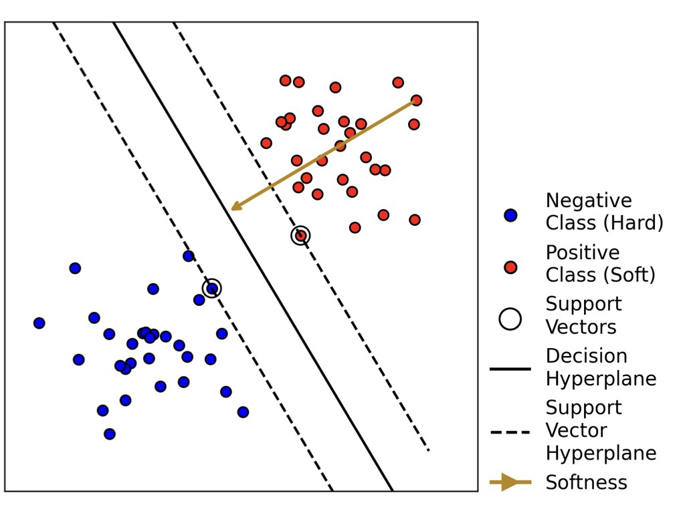
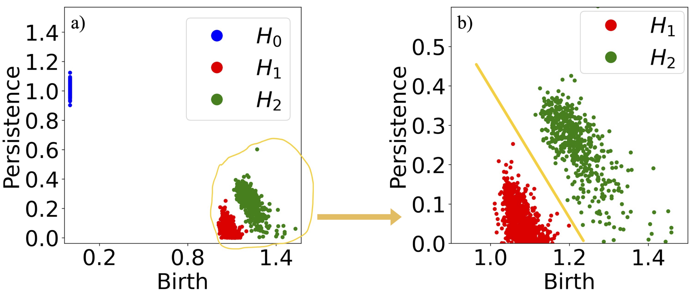
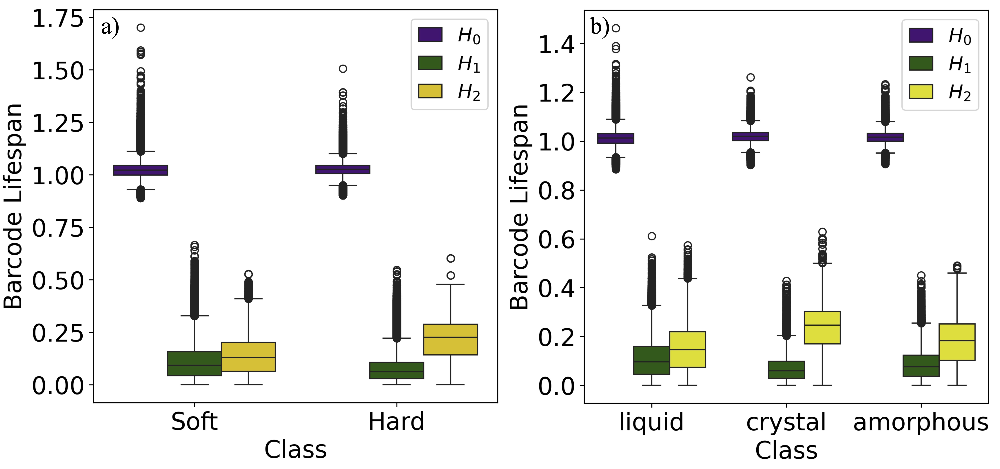
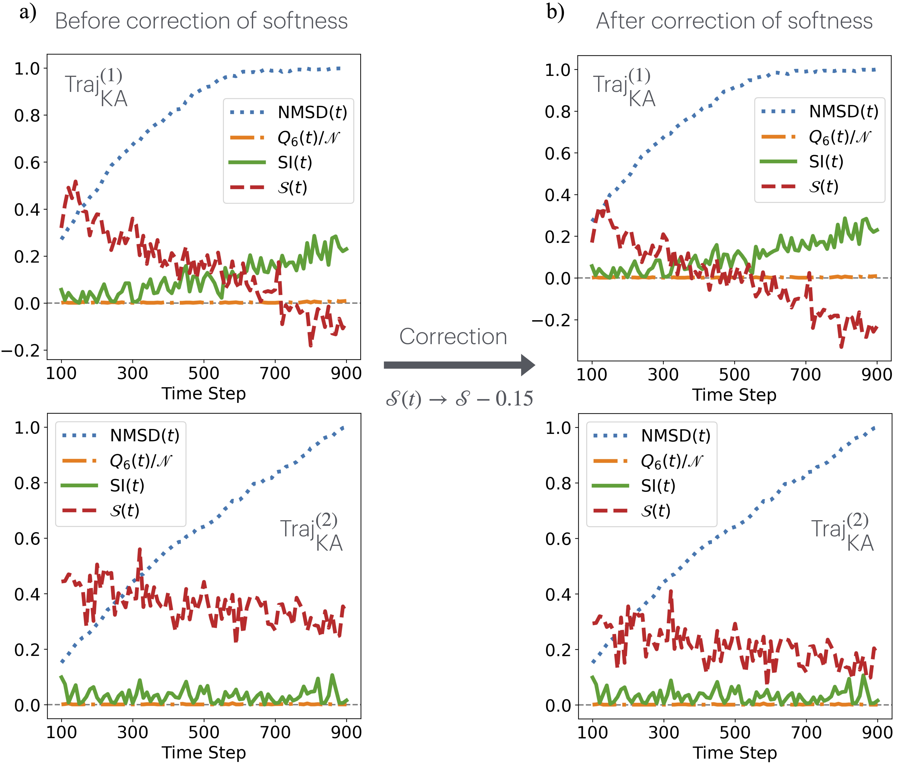

Persistent Homology for Structural Characterization in Disordered Systems
==============

This repository contains the implementation of all algorithms, computed results, and Python scripts for visualizing all figures from the article "Persistent Homology for Structural Characterization in Disordered Systems".

The related article (https://arxiv.org/abs/2411.14390) is accepted by Physical Review E (PRE), see https://journals.aps.org/pre/accepted/38075O23L4d1904d361a1fc060eb72a0fa2b1d54f.

N.B., to help readers intuitively understand how particles and the entire system are mapped into fingerprints (PH vectors) and a single real number (Separation Index), we have specifically written demonstration codes, as detailed in the tail of this page (titled "Sample Checker").

Figures
-----------------

Fig.1 is adapted from Figure 4 of Barcodes: The Persistent Topology of Data (attached in the 'Ref' directory).

Fig.2 is generated by the 'plot.py' script located in the 'Presentation' directory.

Fig.3 is generated by the 'svm_demo.py' script located in the 'Presentation' directory.

Fig.4 is essentially the same as Fig.7b).

Fig.5a) is generated by the 'SI\_neighborhoods.py' script located in the 'Statistics/particle' directory. Before running, please extract the four 7z archive files (cut\_r\_1.5.7z, cut\_r\_2.5.7z, cut\_r\_3.5.7z, and cut\_r\_4.5.7z) in the 'Statistics/particle' directory to that same directory. Notably, running this script may take 5 to 10 minutes, so some patience is required.

Fig.5b) is generated by the 'SI\_system.py' script located in the 'Statistics/system' directory. Before running, please extract the corresponding 7z archive file (barcodes.7z) in the 'Statistics/system' directory to that same directory.

Fig.6a) is generated by the 'betti\_par\_nei_r\_2.5.py' script located in the 'Statistics/particle' directory. Before running, please extract the corresponding archive file (cut\_r\_2.5.7z) in the 'Statistics/particle' directory to that same directory. Notably, running this script may take 10 to 30 minutes, so some patience is required.

Fig.6b) is generated by the 'Betti\_system.py' script located in the 'Statistics/system' directory. Before running, please extract the corresponding 7z archive file (barcodes.7z) in the 'Statistics/system' directory to that same directory.

Fig.7 is generated by the 'PD\_H1H2.py' script located in the 'Statistics/system' directory. Three subplots of Fig.6 are generated respectively using the following variables: a) set\_ = 2, traj\_ = 9, frame\_ = 900; b) set\_ = 5, traj\_ = 1, frame\_ = 900; c) set\_ = 2, traj\_ = 1, frame\_ = 200.

Fig.8 is generated by the 'PD\_H1H2.py' script located in the 'Statistics/particle' directory.

Fig.9a) is generated by 'plot\_avg\_si.py' script located in the 'Softness/LJ\_system' directory.

Fig.9b) is generated by 'plot\_avg\_softness.py' script located in the 'Softness/LJ\_system' directory.

Fig.10a) and Fig.10b) are generated by 'plot.py' script located in the 'Softness/LJ\_system' directory. These two subgraphs corresponds to the following variables: a) num = 3, b) num = 6 in the code.

Fig.10c) is generated by 'plot.py' script located in the 'Softness/KA\_system/KA\_1' directory, and Fig.10d) is generated by 'plot.py' script located in the 'Softness/KA\_system/KA\_2' directory.

Fig.11a) is generated by 'LS\_particle.py' script located in the 'Statistics/particle' directory. Before running, please extract the corresponding archive file (cut\_r\_2.5.7z) in the 'Statistics/particle' directory to that same directory.

Fig.11b) is generated by 'LS\_system.py' script located in the 'Statistics/system' directory. Before running, please extract the corresponding 7z archive file (barcodes.7z) in the 'Statistics/system' directory to that same directory.

Fig.12 is generated by 'decay.py' script located in the 'Presentation' directory.

Fig.13 is generated by 'Select\_Para\_PI.py' script located in the 'Presentation' directory. These subplots of Fig.12 are generated respectively using the following variables: a) myspread = 0.1; b) myspread = 0.002.

Fig.14 is generated by 'def\_rearrangement.py' script located in the 'Dynamics' directory.

Fig.15 is generated by 'histo\_duration.py' script located in the 'Dynamics' directory.

Fig.16 is generated by 'histo\_p\_hop.py' script located in the 'Dynamics' directory.

Fig.17 is essentially the same as Fig.8c) and Fig.8d).

Fig.18a) is generated by 'SoftHard.py' script located in the 'Crossover' directory, and Fig.18b) is generated by 'SI_ordered_disordered.py' script located in the 'Crossover' directory. Before running, please extract the corresponding archive file (all 7z files) in the 'Crossover' directory to that same directory. Notably, running this script may take 5 minutes, so some patience is required.

Fig.19 is generated by 'plot.py' script located in the 'Softness/LJ\_system' directory, the same as Fig.8a) and Fig.8b), with the variable num = 1 to 10, respectively.

MD Simulation
-----------------

This study utilized molecular dynamics simulations to generate data for calculations. 

The trajectories of all LJ systems, along with the distance matrices of each frame sampled from these trajectories, the phases (liquid, amorphous, crystalline) labeled using bond-oriented order parameters and MSD, and the soft-or-hard classification of particles labeled using $p_{\text{hop}}$, are all stored in the 'data' directory.

The directories and their names correspond to the respective contents. Within each subdirectory of data, there are folders or files with names like 'Set_1' and 'Set_2', representing data extracted from Group 1 (training set) and Group 2 (test set), respectively. Specifically, the LAMMPS scripts for MD simulations and the bash files to run them are located in the subdirectories of 'Traj'. The 'in.LAMMPS' file is the execution script, 'data.0' is the topology file generated after running the script, 'traj.dcd' is the trajectory file saved under PBC (for structural aspects), 'traj_unwrap.dcd' is the trajectory file saved under the unwrapped system (for dynamical aspects), and 'nuc.log' is the log file. 

Note that the simulations for the KA system (Group 3) are stored in the 'Softness/KA\_system' directory, which has a similar directory structure.

Persistent Homology
-----------------

In this study, we use the Ripser package to calculate the persistent homology (PH) of a point cloud data. The 'PH\_process' directory primarily contains code for performing PH analysis on point cloud data extracted from trajectories of MD simulations. It also includes code for generating local and global PH descriptors, as well as MATLAB scripts for machine learning (Task 1 for particle classification). Note that the relevant code for the dataset construction in Task 2 (global phase classification) is contained in 'System/Data_Task_2' directory, with a similar directory structure as described above.

The 'PH.py' is the script for generating the PH vectors for a point cloud. Note that This file defines several functions starting with the prefix 'PH\_barcode', which represent the use of specific information of homology classes when generating PH descriptors. For example, suffixes like 'h0h1' indicate that the $H\_0$ and $H\_1$ homology classes are considered, while other suffixes follow a similar pattern.

Performing PH analysis and generating PH descriptors for the massive point clouds of particle neighborhoods is computationally intensive, so these tasks are processed in batches. The corresponding codes are stored in 'PH_process/code' directory.

The codes in 'PH\_process/code/generate\_PH' directory are used to compute the PH information for the neighborhoods of all particle samples in Set 1 and Set 2 mentioned in the paper. The codes in 'PH\_process/code/PH2PI' directory handle the conversion of PH results into Persistent Images (PI) and flatten them into PH vectors to be used as inputs for machine learning. The codes in 'PH\_process/code/dataset' directory are responsible for constructing machine learning datasets. Note that all '*.py' files must be copied to the root directory of 'PH_process' for execution.

Machine Learning (Task 1)
-----------------

The matlab code and data for Task 1 are contained in 'PH\_process/matlab' directory.

All files in directory 'PH_process/matlab/database' are generated by the code in 'PH\_process/code/dataset'. These data are utilized by the code in 'PH\_process/matlab/code/generate_dataset' to create training and test sets, which are stored in 'PH\_process/matlab/dataset'. In this structure of directories, 'exp\_1' corresponds to Group 1 (training group), and 'exp\_2' corresponds to Group 2 (test group). The filenames in these directories are largely similar, with '.mat' indicating MATLAB data files, 'Exp\_1' representing Group 1, and 'Exp\_2' representing Group 2. The suffix 'p\_98' signifies that the feature matrix has undergone PCA, retaining 98\% of the variance (and similarly for other cases).

The 'PH\_process/matlab/code/pca' directory contains the scripts for performing PCA on the feature matrices. Note that there are two scripts, i.e., 'pca\_1.m' and 'pca\_2.m', because the PCA for Group 2 must use the same method as that for Group 1. Therefore, the PCA method applied to Group 1 must be saved and stored in the 'PH\_process/matlab/pca' directory. When performing PCA on the feature matrix of Group 2, this saved method is read and applied.

The 'PH\_process/matlab/code/train' directory contains the training scripts, with file names following the same naming convention as previously described. Scripts with names starting with 'Exp\_1' indicate that, after model selection on Group 1, testing is conducted on the original dataset. Scripts with names starting with 'Exp\_2' indicate that, after model selection on Group 1, the model is applied to Group 2 for testing. Note that the results for Task 1 in the paper are derived from the scripts with names starting with 'Exp\_2'.

Machine learning is executed using the MATLAB Classification Learner App, and the entire training process is fully recorded in sessions for verification. These session records are stored in the 'PH\_process/matlab/results' directory. As mentioned earlier, the results for Task 1 in the paper are located in 'PH\_process/matlab/results/exp\_2', representing the results of testing on Group 2 after the model selection on Group 1.

Feature Importance Analysis (Task 1)
-----------------

The code and data for the Feature Importance Analysis of Task 1 are located in the 'Importance' directory. This directory contains the training results that use information from each homology class, calculated as Shapley values, as inputs to the model. The organization of this directory is similar to that of the data generation and training directories mentioned earlier.

Machine Learning and Feature Importance Analysis (Task 2)
-----------------

Before performing the machine learning workflow for Task 2, data generation is essential. This process is executed by the code in the 'System/Data\_Task\_2' directory, which has a directory structure similar to that of Task 1, so it will not be explained in further detail. The code and data for the Feature Importance Analysis of Task 2 are located in the 'System/Data\_FIA\_Shapley' directory. The organization of this directory is similar to the related directories introduced earlier.

The machine learning code for Task 2, using each homology class and their combinations as inputs, along with the saved models and MATLAB Classification Learner session records, are stored in the 'System/matlab' directory. The organization of this directory is consistent with the related sections mentioned earlier.

Parameter Selection for PI vectors
-----------------

The optimal $\sigma$ for Task 2 was determined by evaluating the performance of models using PIs corresponding to different $\sigma$ values as inputs. The code, data, and MATLAB Classification Learner session records for this process are stored in the 'System/Hyperparameters' directory, which follows a similar organizational structure to the other directories. Notably, parameter selection was executed prior to both Task 1 and Task 2.

Descriptive Statistics on PH results
-----------------

The Separation Index (SI) is defined on the descriptive statistics on PH results. The SI of particle neighborhoods is located in directory 'Statistics/particle', while the SI of the global system is located in directory 'Statistics/system'.

For particle neighborhoods, PH calculations are performed in four subdirectories under 'Statistics/particle', each named with a prefix 'cut\_r'. To save space, these subdirectories have been compressed into corresponding 7z files. The 'generate_PH.py' script within each subdirectory handles the PH calculations. Once these calculations are completed, the scripts in 'Statistics/particle' can be executed to produce the figures featured in the paper.

For the global system, PH calculations are conducted using the 'generate_PH.py' script located in 'Statistics/system'. Similarly, this script must be run first before executing the code responsible for computing and generating the figures presented in the paper.

7-zip compressed files
-----------------

Because GitHub enforces a 100MB file size limit, some MATLAB Classification Learner sessions have been split into multiple 7z archive files. These files must be extracted before use.

Some Extra Data
-----------------

The "Extra" directory stores additional code or data, including content for experiments requested by reviewers or supplementary test code added later.

Besides, the "Extra/Extra_PCA_Task_1" directory contains training session records exported from Matlab's Classification Learner for Task 1. These sessions record the training process with different numbers of predictors (ranging from 1 to 7) obtained through PCA on the feature matrix. Please read "README.pdf" in the "Extra/Extra\_PCA\_Task\_1" directory to know how to open the session files saved by MATLAB Classification Learner.

How to open the session file saved by MATLAB Classification Learner
-----------------

See "Extra/Extra\_PCA_Task\_1/README.pdf". The method for opening all session files is generally the same.

Some Extra Figures
-----------------

If we merge the "crystal" and "amorphous" categories in Fig. 5b) into a single "solid" category, we can obtain the following figure. The script used to generate this figure is "Statistics/system/SI\_binary.py."

Sample Checker
-----------------

To help readers intuitively understand how particles and the entire system are mapped into fingerprints (PH vectors) and a single real number (Separation Index), we have specifically written these demonstration codes. All codes are located in "Sample_Checker" directory. This article investigates two types of samples: particle samples with a state set of {soft, hard}, and global system samples with a state set of {crystal, amorphous, liquid}.

For the machine learning task, it essentially involves fitting a composite mapping $y = f(g(x))$, where $y$ represents the state set, $f$ is the support vector machine, and $g$ refers to the fingerprint, specifically the PH vector for both the particle and the entire system. The calculation method for the particle's PH vector is demonstrated in file `Sample_Checker/PI_vec_particle.py`, with the resulting column vector saved in `Sample_Checker/PI_vec_particle.txt` and displayed on the console. The calculation method for the system's PH vector is demonstrated in file `Sample_Checker/PI_vec_system.py`, with the resulting column vector saved in `Sample_Checker/PI_vec_system.txt` and displayed on the console.

For the non-machine learning task, it essentially involves establishing a mapping from the persistent homology results of particles or the entire system to the range $[0, +\infty)$, known as the Separation Index (SI). The SI for particles (or the local environment of particles) is demonstrated in file `SI_particle.py`, and the SI for the entire system is demonstrated in file `SI_system.py`. The results are directly displayed on the console.

N.B., for the LJ system, it is divided into two groups, each corresponding to 10 trajectories. Each trajectory records 1001 frames, with timestamps ranging from 0 to 1000. The system consists of 864 particles, numbered from 0 to 863. These parameters are declared at the head of the corresponding code, as detailed in the comments.

This part of the code is solely intended to demonstrate the computational logic and intuitively present the demonstration. To save time and facilitate demonstration, some parameters have been modified. For reproducing the results in the article, please use the corresponding code as specified.

